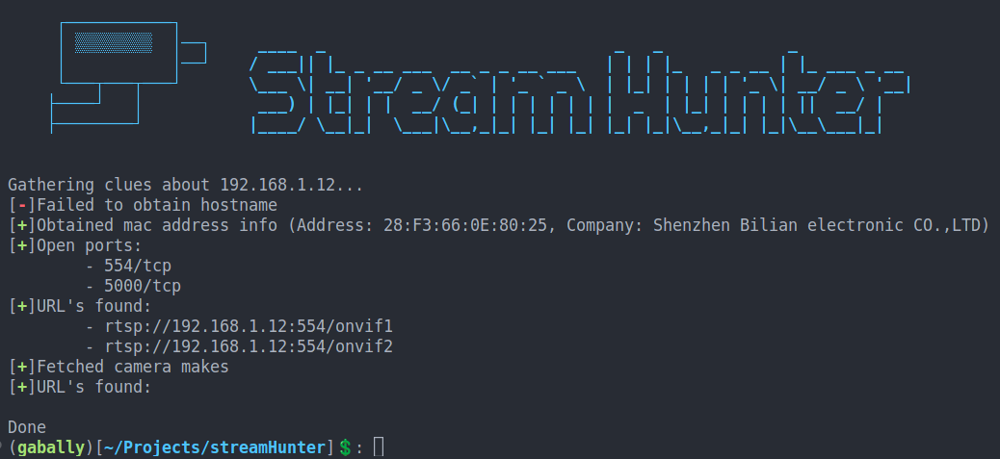

# StreamHunter

a python script to find IP Cameras streaming url's automatically.

The script will try to gather clues about the camera's make and model, and try to find any streaming URLS using onvif and using the www.ispyconnect.com database. It can also bruteforce common default credentials automatically.

## Install

`pip install -r requirements.txt`

and 

`
python3 streamHunter.py
`

## Screenshots

